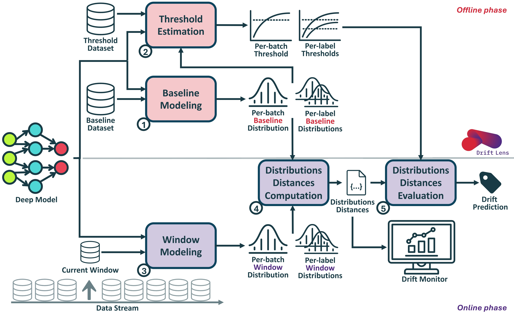

#
<div align="center">
  
  <h4>Unsupervised Concept Drift Detection <br> from Deep Learning
Representations on Unstructured Data in Real-time</h4>
</div>
<br/>


*DriftLens* is an **unsupervised drift detection** framework for deep learning classifiers on unstructured data.

The *DriftLens* methodology and its evaluation is currently **Under Review**.


The preliminary idea was first proposed in the paper:

[Drift Lens: Real-time unsupervised Concept Drift detection by evaluating per-label embedding distributions](https://ieeexplore.ieee.org/document/9679880) **(Greco et al., 2021)**


## Table of Contents
- [Installation](#installation)
- [Example of usage](#example-of-usage)
- [DriftLens Methodology](#driftlens-methodology)
- [Experiments Reproducibility](#experiments-reproducibility)
- [References](#references)
- [Authors](#authors)

## Installation
DriftLens is available on PyPI and can be installed with pip for Python >= 3:
```bash
# Install latest stable version
pip install drift-lens

# Alternatively, install latest development version
pip install git+https://github.com/grecosalvatore/drift-lens
```

## Example of usage
```python
```

## DriftLens Methodology
<div align="center">
  
  <h4>DriftLens Methodology.</h4>
</div>
<br/>
DriftLens is an unsupervised drift detection technique based on distribution distances within the embedding representations generated by deep learning models.
The methodology includes an *offline* and an *online* phases. 


In the *offline* phase, DriftLens, takes in input a historical dataset (i.e., baseline and threshold datasets), then: 
1) Estimates the reference distributions from the baseline dataset (e.g., training dataset). The reference
distributions, called **baseline**, represent the distribution of features (i.e., embedding) that the model has learned during the training phase (i.e., they represent the absence of drift).
2)Estimates threshold distance values from the threshold dataset to discriminate between drift and no-drift conditions.

In the *online* phase, the new data stream is processed in windows of fixed size. For each window, DriftLens:

3) Estimates the distributions of the new data windows 
4) it computes the distribution distances with respect to the reference distributions
5) it evaluates the distances against the threshold values.  If the distance exceeds the threshold, the presence of drift is predicted.

## Experiments Reproducibility
Instructions and scripts for the experimental evaluation reproducibility are located in the experiments folder.

## References
If you use the DriftLens, please cite the following papers:

1) DriftLens methodology and evaluation
The paper is currently **under review** at the VLDB conference.
```bibtex
```

2) Preliminary idea
```bibtex
@INPROCEEDINGS{driftlens,
  author={Greco, Salvatore and Cerquitelli, Tania},
  booktitle={2021 International Conference on Data Mining Workshops (ICDMW)}, 
  title={Drift Lens: Real-time unsupervised Concept Drift detection by evaluating per-label embedding distributions}, 
  year={2021},
  volume={},
  number={},
  pages={341-349},
  doi={10.1109/ICDMW53433.2021.00049}
  }
```

3) Webapp tool
```bibtex
```

# Authors

- **Salvatore Greco**, *Politecnico di Torino* - [Homepage](https://grecosalvatore.github.io/) - [GitHub](https://github.com/grecosalvatore) - [Twitter](https://twitter.com/_salvatoregreco)
- **Bartolomeo Vacchetti**, *Politecnico di Torino* - [Homepage]()
- **Daniele Apiletti**, *Politecnico di Torino* - [Homepage](https://www.polito.it/en/staff?p=daniele.apiletti)
- **Tania Cerquitelli**, *Politecnico di Torino* - [Homepage](https://dbdmg.polito.it/dbdmg_web/people/tania-cerquitelli/)